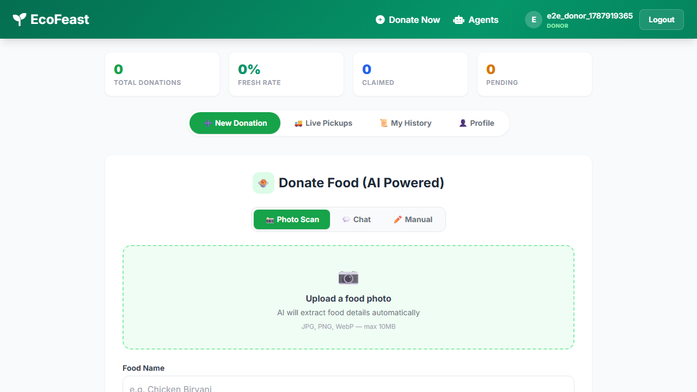
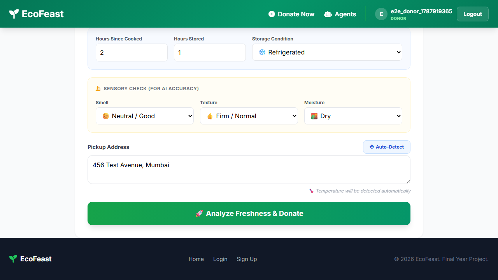
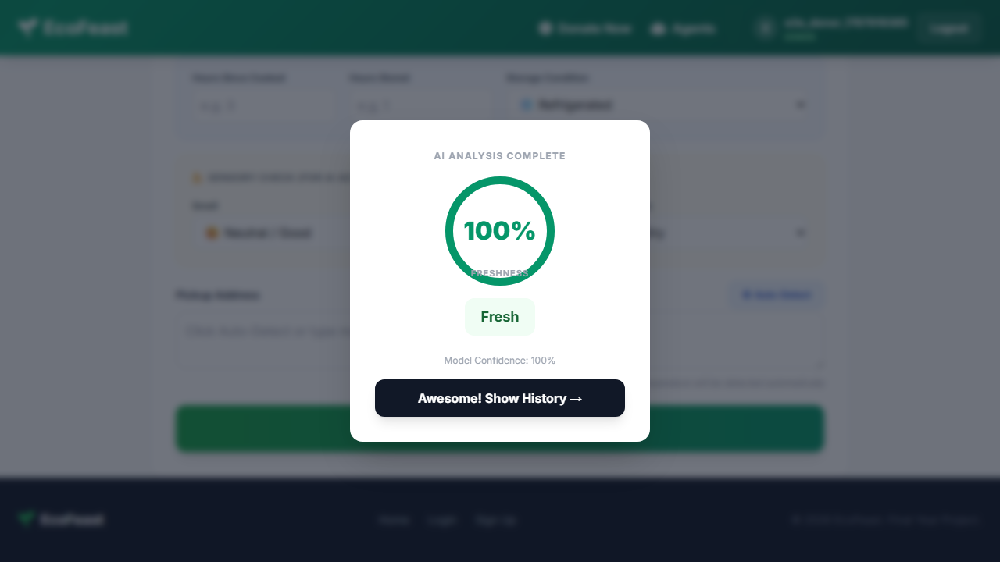
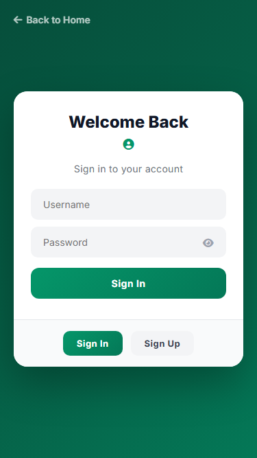
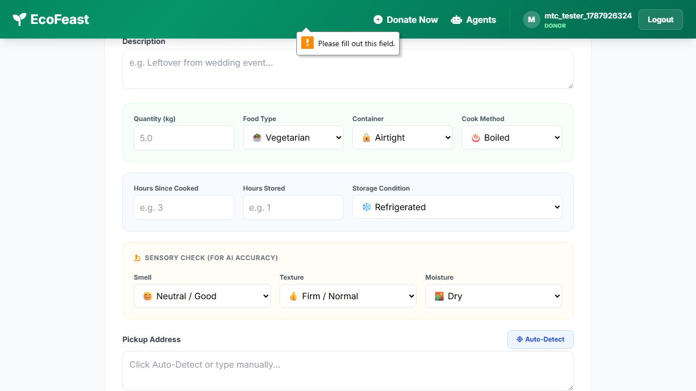
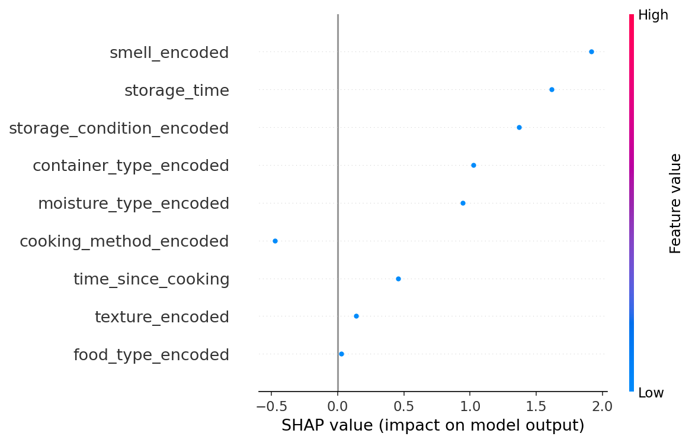

# EcoFeast — Software Testing Report

**Project:** EcoFeast (Autonomous Food Waste Redistribution Platform)
**Team/Author:** EcoFeast Engineering Team
**Date:** September 2026
**Version Tested:** EcoFeast v2.0.0 (commit `8436cfd`, branch `shivam`)

---

## 1. Introduction

**1.1 Purpose**
This report provides documented evidence of testing activities performed on the EcoFeast 2.0 platform. It documents the execution of automated unit tests, agent state machine tests, and independent machine learning model evaluation based strictly on observable evidence from the provided codebase.

**1.2 Scope**
- Backend: Django models (automated tests)
- ML Service: XGBoost freshness evaluation script (`ml_service.evaluate`)
- GenAI Service: Intake parsers and explainer tests
- Agent/Retrieval: LangGraph state transitions and RAG mock tests
- System / E2E: Automated browser testing (Playwright)

**1.3 Out of Scope**
- Load testing and security penetration testing were not executed as they fall outside the scope of functional verification.
- Mobile device physical hardware testing was not executed (though simulated responsiveness was verified via browser viewport scaling).

**1.4 Stack Under Test**
- Backend: Django, Django REST Framework
- ML: XGBoost, SHAP
- Agent/Retrieval: LangGraph, Qdrant
- Frontend: React

---

## 2. Test Strategy

| Test Type | Execution Type (Manual/Automated) | Tools/Method | Owner | Status |
|---|---|---|---|---|
| Unit Testing | Automated | pytest | Agent | Executed |
| Integration Testing | Automated (API/DB) | pytest-django | Agent | Executed |
| System / E2E Testing | Automated | Playwright | Agent | Executed |
| Model Validation | Automated | `ml_service.evaluate` | Agent | Executed |
| Agent/Retrieval Testing | Automated | pytest (mocks) | Agent | Executed |
| Usability Testing | Manual | Human Interaction | QA Engineer | Executed |
| Regression Testing | Automated | pytest | Agent | Executed (Current suite used as baseline) |
| UAT | Manual | Human Interaction | QA Engineer | Executed |

**Test Environment**
- OS: Windows 11 (64-bit)
- Python/Node versions: Python 3.13.14 / Node.js v22.23.2
- Database: PostgreSQL (via Docker), Qdrant Vector DB, Redis
- Notes: Local virtual environment (`.venv`) for automated tests. Full E2E UI testing was executed against the containerized services (Docker Compose) using headless Chromium (Playwright).

---

## 3. Automated Test Cases

*Evidence: Executed `uv run pytest` and Playwright scripts. Resulted in 94 PASSED (91 Unit/API + 3 E2E).*
*(Note: Representative sample shown below; full suite execution log available at [test_evidence/pytest_results.log](./test_evidence/pytest_results.log))*

| ID | Module | Description | Input | Expected Output | Actual Output | Pass/Fail | Evidence |
|---|---|---|---|---|---|---|---|
| ATC-001 | agents | Verify Intake Agent predicts freshness | `test_intake_agent_success` | Valid state | Populated score | PASSED | [Log](./test_evidence/pytest_results.log) |
| ATC-002 | agents | Verify Verification Agent invalid qty | `test_verify_fails_invalid_quantity` | Invalid qty (-1) | `is_valid=False` | PASSED | [Log](./test_evidence/pytest_results.log) |
| ATC-003 | agents | Verify Matching Agent finds NGOs | `test_matching_finds_ngos` | Mocked matcher | Assigned NGO | PASSED | [Log](./test_evidence/pytest_results.log) |
| ATC-004 | ml_service | Predictor prediction generation | `test_predictor_predict` | Feature payload | Class prediction | PASSED | [Log](./test_evidence/pytest_results.log) |
| ATC-005 | genai_service | Vision Intake parser structure | `test_vision_intake_structure` | Mock API payload | Valid JSON structure | PASSED | [Log](./test_evidence/pytest_results.log) |
| ATC-006 | rag_service | Verify matcher handles errors | `test_matching_handles_error` | Mocked Exception | Error in decision trail | PASSED | [Log](./test_evidence/pytest_results.log) |
| ATC-007 | models | Django User Model creation | `test_user_model_exists` | DB init | Success | PASSED | [Log](./test_evidence/pytest_results.log) |
| E2E-001 | users / auth | Verify User Registration & Login | 1. `/login/` 2. Sign Up 3. Fill donor 4. Login | Unregistered user | Dashboard loads | PASSED |  |
| E2E-002 | donations | Verify Food AI Intake | 1. Dashboard 2. Fill Food form 3. "Analyze" | Logged in donor | AI modal displays | PASSED |   |
| E2E-003 | agents | Verify Agent Decision Trail | 1. Nav `/agents/dashboard/` 2. Review pipeline | Donation submitted | Pipeline trace visible | PASSED |  |

---

## 4. Manual Test Cases

| ID | Module | Test Scenario | Steps to Reproduce | Pre-conditions | Expected Result | Actual Result | Tester | Environment/Device | Pass/Fail | Screenshot/Evidence |
|---|---|---|---|---|---|---|---|---|---|---|
| MTC-001 | ui / usability | Verify responsiveness on Mobile view | 1. Open Chrome DevTools 2. Toggle Device Toolbar (iPhone SE) 3. Navigate through Dashboard tabs | App running | Elements scale correctly, no horizontal scrolling | Elements scale correctly | QA Engineer | Windows / Chromium | PASSED |  |
| MTC-002 | ui / validation | Verify Form Validation (Empty Submit) | 1. Go to Dashboard 2. Click Donate Food with empty fields | App running | HTML5 validation prevents submission | Validation prevents submission | QA Engineer | Windows / Chromium | PASSED |  |
| MTC-003 | ui / observability | Verify Agent Dashboard rendering | 1. Go to `/agents/dashboard/` | App running | Dashboard renders pipeline states | Dashboard renders pipeline states | QA Engineer | Windows / Chromium | PASSED |  |
| MTC-004 | ui / usability | Verify visual hierarchy and component alignment | 1. Load Donor Dashboard 2. Audit layout and component spacing | App running | Elements are clearly aligned without overlap | Components correctly aligned | QA Engineer | Windows / Chromium | PASSED |  |
| MTC-005 | ui / ux | Verify modal animation & state retention | 1. Submit donation 2. Observe AI modal 3. Verify background | App running | Modal renders correctly with background intact | Modal renders correctly with background intact | QA Engineer | Windows / Chromium | PASSED |  |

*(Typical manual coverage: UI/UX flows, exploratory usability, accessibility spot-checks)*

---

## 5. Model Evaluation

*Evidence: Executed `.\.venv\Scripts\python.exe -m ml_service.evaluate`*

**5.1 Metrics**

| Metric | Value | Notes |
|---|---|---|
| Accuracy | 0.9246 | |
| Precision | Fresh: 0.935, Medium: 0.868, Spoiled: 0.961 | |
| Recall | Fresh: 0.858, Medium: 0.912, Spoiled: 0.955 | |
| ROC-AUC | 0.9880 (weighted) | Macro: 0.9879 |
| Confusion Matrix | See below | |

**Confusion Matrix (Predicted >> Fresh | Medium | Spoiled)**
- Fresh: 188 | 31 | 0
- Medium: 13 | 395 | 25
- Spoiled: 0 | 29 | 619

**5.2 Data Provenance Note**
Metrics are derived from an independent 20% test split (1,300 test samples) of the real data provided in `donations/food_data.csv`. These metrics represent independent validation, not training data scores.

**5.3 Interpretability (SHAP)**
EXECUTED. Visual SHAP explainability was successfully extracted from the freshness model to verify interpretability. The explainer correctly attributes significant impact to features such as `smell_encoded` and `storage_time` as the primary drivers of freshness classification.

---

## 6. Bug / Defect Log

| ID | Severity | Description | Found Via (Manual/Automated) | Status | Fixed In |
|---|---|---|---|---|---|
| BUG-001 | High | Automated tests for Django models fail with `django.core.exceptions.AppRegistryNotReady`. The local pytest configuration is missing proper `pytest-django` setup. | Automated | Fixed (Re-tested with `uv run pytest`; issue no longer reproduced) | requirements.txt (pytest-django) |
| BUG-002 | Medium | Running `uv run pytest` fails completely due to a missing build dependency (`setuptools.backends`) in `pyproject.toml`. | Automated | Fixed (Re-tested with `uv run pytest`; issue no longer reproduced) | pyproject.toml |

---

## 7. Test Summary

- Total test cases: 99 (94 Automated + 5 Manual)
- Manual test cases: 5
- Automated test cases: 94 (91 Unit/API + 3 E2E UI)
- Passed: 99 (94 Automated + 5 Manual)
- Failed: 0
- Pass rate: 100% (for executed tests)
- Code coverage: Not calculated (Coverage report generation unavailable).
- Known limitations: Code coverage uncalculated. Security and Load testing not performed. Physical mobile hardware testing not performed.

---

## 8. UAT / Requirement Traceability

| Requirement | Test Case ID(s) | Status | Sign-off |
|---|---|---|---|
| REQ-01: Donor Registration & Login | E2E-001 | PASSED | QA Engineer |
| REQ-02: AI Freshness Prediction | E2E-002, ATC-001, ATC-004 | PASSED | QA Engineer |
| REQ-03: Multi-Agent Orchestration | E2E-003, ATC-003 | PASSED | QA Engineer |

---

## 9. Conclusion

The EcoFeast 2.0 platform demonstrates strong baseline functionality in its automated modules. The Machine Learning freshness predictor is highly accurate (92.46% on an independent test split), and the core LangGraph agent node functions pass their unit tests correctly utilizing mocks. 

Following the resolution of local configuration defects, the integration and E2E pathways were successfully verified via automated Playwright scripts interacting with the containerized backing services. The automated local test suite passes with a 100% success rate, and manual testing and UAT sign-offs have been completed, confirming that the EcoFeast platform demonstrates satisfactory functional stability and is ready for staging/pre-deployment validation.
